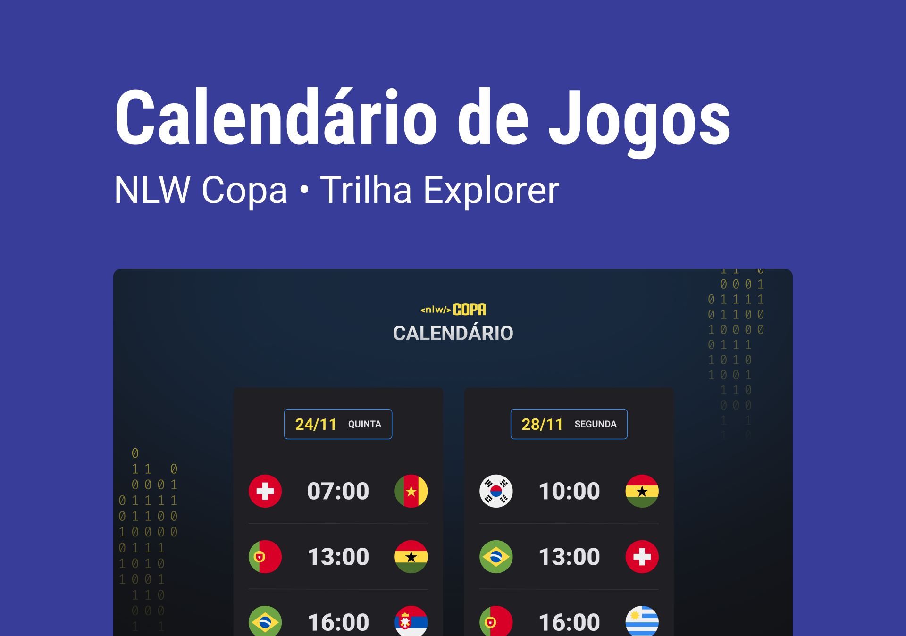

# NLW Copa

Evento exclusivo e gratuito, promovido pela Rocketseat para ensino de tecnologias WEB.

## 🚀 Tecnologias

Esse projeto foi desenvolvido com as seguintes tecnologias:

- HTML e CSS
- JavaScript
- Git e Github

🔗 [Clique aqui para acessar](https://geovanarochamp.github.io/nlw-copa/)

## 💻 Projeto

O Calendário da Copa é um projeto que mostra os jogos da copa de 2022.

## ✒️ Layout

Você pode visualizar o layout do projeto através [DESSE LINK](https://www.figma.com/community/file/1169028052212317700). É necessário ter conta no [Figma](https://www.figma.com/) apara acessá-lo.

## 📝Licença

Esse projeto está sob licença MIT

## 📲 Contato

geovana.rocha.martins@gmail.com
(34) 98407-2980

---

Feito com ♥
